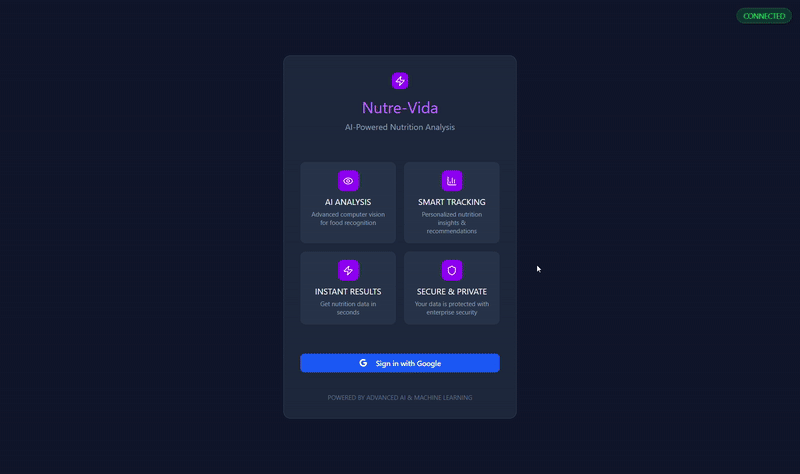
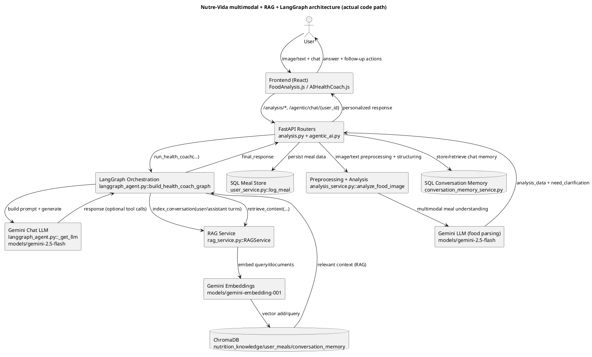

# 🍽️ Nutre-Vida - AI-Powered Nutrition Tracking & Smart Notifications

A comprehensive nutrition tracking application with AI-powered food analysis and intelligent meal recommendations.




## 🌟 Features

### 🤖 AI-Powered Food Analysis
- **Image Recognition**: Upload food photos for instant nutritional analysis
- **Text Analysis**: Describe your meal in text for quick logging
- **Google Gemini Integration**: Advanced AI for accurate food identification
- **Nutritional Breakdown**: Detailed calories, macros, and micronutrients
- **Portion Estimation**: Smart portion size detection and recommendations


### 📊 Comprehensive Reporting
- **Daily Summaries**: End-of-day nutrition insights
- **Weekly Reports**: Detailed analysis with trends and charts
- **Monthly Analysis**: Comprehensive health journey overview
- **PDF Generation**: Professional reports with visualizations
- **Goal Tracking**: Monitor progress towards nutrition targets

### 🎯 Intelligent Recommendations
- **Healthy Swaps**: AI-suggested healthier alternatives
- **Personalized Advice**: Tailored recommendations based on dietary preferences
- **Meal Planning**: Smart meal suggestions and planning
- **Nutritional Insights**: Deep analysis of eating patterns

### 🔐 User Management
- **Google OAuth**: Seamless authentication with Google accounts
- **Profile Management**: Customizable dietary preferences and goals
- **Privacy Controls**: Granular notification and privacy settings
- **Multi-user Support**: Individual user profiles and data isolation

## 🚀 Quick Start

### Prerequisites
- Python 3.8 or higher
- Google API Key (for Gemini AI)
- Twilio Account (for WhatsApp notifications)
- Gmail Account with App Password (for email notifications)

### Installation

1. **Clone the repository**
   ```bash
   git clone https://github.com/tharunkumarvk/celestia-main
   cd celestia-main\celestia-backend-main-functional
   ```

2. **Install dependencies**
   ```bash
   pip install -r requirements.txt
   ```


3. **Initialize the database**
   ```bash
   python init_tables.py
   ```

4. **Start the application**
   ```bash
   cd celestia-main\celestia-backend-main-functional\celestia-fullyfunctional-backend
   uvicorn app.main:app --reload --host 0.0.0.0 --port 8000
   ```

6. **Access the application**
   - API Documentation: `http://localhost:8000/docs`
   - Health Check: `http://localhost:8000/health`
   - Frontend: `http://localhost:3000` 

## 📱 API Endpoints

### Authentication
- `POST /users/google` - Google OAuth authentication
- `GET /users/{user_id}` - Get user profile
- `PUT /users/{user_id}` - Update user profile

### Food Analysis
- `POST /sessions/` - Create new analysis session
- `POST /analysis/upload/{session_id}` - Upload food image
- `POST /analysis/analyze/{session_id}` - Analyze uploaded image
- `POST /analysis/analyze_text/{session_id}` - Analyze text description
- `GET /analysis/results/{session_id}` - Get analysis results

### Nutrition & Recommendations
- `GET /nutrition/lookup` - Get detailed nutrition information
- `GET /recommendations/healthy-swaps` - Get healthy alternatives
- `GET /recommendations/personalized` - Get personalized recommendations

### Dashboard & Analytics
- `GET /dashboard/summary` - Get user dashboard data
- `GET /dashboard/trends` - Get nutrition trends
- `GET /dashboard/goals` - Get goal progress

## 🧠 LangGraph + RAG Architecture (Interview Deep Dive)

This section maps the statement below to the **actual implementation**:

> "An AI nutrition assistant using LangGraph to process multimodal inputs (food images and text) with conversational memory for personalized guidance. Integrated Retrieval-Augmented Generation (RAG) to retrieve user meal history and preferences, enabling context-aware meal planning through a stateful chatbot workflow."

### 1) "AI nutrition assistant" in this repo

- **Meaning here:** The assistant is the backend orchestration that combines food analysis, user profile/goals, history, and LLM responses.
- **Implemented in:**
  - `app/routers/agentic_ai.py` → `enhanced_chat(...)` (`POST /agentic/chat/{user_id}`)
  - `app/services/enhanced_agent_service.py` → `EnhancedAgenticService.enhanced_chat(...)`
  - `app/services/langgraph_agent.py` → `run_health_coach(...)`
- **What it does:** Receives user chat, gathers user context (profile, meals, alerts, memory), invokes LangGraph response flow, returns personalized guidance.

### 2) "LangGraph" in this repo

- **Meaning here:** A graph-based state machine for chat response generation.
- **Implemented in:**
  - `app/services/langgraph_agent.py`
    - State schema: `AgentState`
    - Nodes: `analyze_intent`, `retrieve_context`, `build_prompt_and_call_llm`, `format_output`
    - Graph builder: `build_health_coach_graph()`
    - Runtime entrypoint: `run_health_coach(...)`
- **Graph edges in code:**  
  `analyze_intent → retrieve_context → generate` and then conditional loop `generate ↔ tools` or `generate → format_output → END`.

### 3) "multimodal input (food images and text)" in this repo

- **Meaning here:** The meal analyzer accepts either image bytes or text descriptions.
- **Implemented in:**
  - `app/routers/analysis.py`
    - image upload: `upload_image(...)` (`POST /analysis/upload/{session_id}`)
    - image analysis: `analyze(...)` (`POST /analysis/analyze/{session_id}`)
    - text analysis: `analyze_text(...)` (`POST /analysis/analyze_text/{session_id}`)
  - `app/services/analysis_service.py`
    - unified function: `analyze_food_image(image_or_text, user_profile)`
- **Important behavior:** The uploaded image is kept in in-memory session state (`sessions[session_id]["image"]`) for analysis, while persisted meal history stores extracted structured analysis (`analysis_data`, `nutrition_summary`) via `user_service.log_meal(...)`.

### 4) "conversational memory" in this repo

- **Meaning here:** Two memory layers are used:
  1. SQL conversation log for session/user history and relevance scoring.
  2. Vector conversation memory for semantic retrieval in RAG context.
- **Implemented in:**
  - SQL memory: `app/services/conversation_memory_service.py`
    - `store_conversation(...)`, `get_contextual_memory(...)`, `get_session_history(...)`
  - Vector memory: `app/services/rag_service.py`
    - `index_conversation(...)`, `retrieve_conversation_context(...)`
  - Called from:
    - `EnhancedAgenticService.enhanced_chat(...)` (SQL memory)
    - `run_health_coach(...)` (indexes user/assistant turns into RAG conversation store)

### 5) "RAG" in this repo

- **Meaning here:** Retrieve external and personal context before generation.
- **Implemented in:**
  - `app/services/rag_service.py` (`RAGService`)
    - Knowledge base: `_index_nutrition_knowledge()`, `retrieve_nutrition_knowledge(...)`
    - User meals: `index_user_meal(...)`, `retrieve_user_meals(...)`, `bulk_index_user_meals(...)`
    - Conversation: `index_conversation(...)`, `retrieve_conversation_context(...)`
  - Startup initialization:
    - `app/main.py` → `startup_event()` calls `get_rag_service().initialize()`
  - LangGraph retrieval node:
    - `app/services/langgraph_agent.py` → `retrieve_context(...)`

### 6) "context-aware meal planning" in this repo

- **Meaning here:** Meal plans are generated using user goals/preferences + retrieved nutrition context.
- **Implemented in:**
  - `app/services/langgraph_agent.py` → `generate_langgraph_meal_plan(...)`
    - Builds retrieval query using dietary restrictions/cuisine
    - Pulls context via `rag.retrieve_nutrition_knowledge(...)`
    - Prompts Gemini with user profile + goals + retrieved context
  - Orchestrated by:
    - `app/services/enhanced_agent_service.py` → `create_intelligent_meal_plan(...)`
    - `app/routers/agentic_ai.py` → `create_intelligent_meal_plan(...)` endpoint

### 7) "stateful chatbot workflow" in this repo

- **Meaning here:** Request handling carries explicit state (`AgentState`) plus persisted per-user memory and session IDs.
- **Implemented in:**
  - Graph state object: `AgentState` in `langgraph_agent.py`
  - Session continuity: `ConversationMemoryService.create_session_id()` and `session_id` in chat request/response
  - Stateful node execution and tool loop: `build_health_coach_graph()`

---

## 🔄 End-to-end data flow (actual code path)

### A. Multimodal meal ingestion path (image/text → structured meal data)

1. **Client submits image or text**
   - Image: `POST /analysis/upload/{session_id}` then `POST /analysis/analyze/{session_id}`
   - Text: `POST /analysis/analyze_text/{session_id}`
2. **Router validates and dispatches**
   - `app/routers/analysis.py` calls `analyze_food_image(...)`.
3. **Gemini analysis runs**
   - `app/services/analysis_service.py::analyze_food_image(...)` handles either `PIL.Image` or `str`.
4. **Structured nutrition output is produced**
   - `items`, macros, calories, clarification flags.
5. **Meal is logged**
   - `app/services/user_service.py::log_meal(...)` persists extracted meal/nutrition data.
6. **Result**
   - These stored meal records become retrievable context for later chat/RAG.

### B. Agentic chat path (user message → LangGraph nodes → personalized response)

1. **Chat entrypoint**
   - `POST /agentic/chat/{user_id}` → `agentic_ai.py::enhanced_chat(...)`.
2. **Orchestration service starts**
   - `EnhancedAgenticService.enhanced_chat(...)`:
     - creates/uses `session_id`,
     - stores user turn in SQL conversation memory (`store_conversation`),
     - gets contextual memory (`get_contextual_memory`),
     - pulls user meal history/profile/alerts.
3. **LangGraph invoked**
   - Calls `run_health_coach(...)` with assembled context.
4. **Node 1: `analyze_intent`**
   - Classifies into `meal_planning`, `meal_history`, `nutrition_lookup`, `goal_tracking`, or `general_chat`.
5. **Node 2: `retrieve_context` (RAG)**
   - Pulls:
     - nutrition KB (`retrieve_nutrition_knowledge`),
     - relevant user meals (`retrieve_user_meals`),
     - relevant conversation snippets (`retrieve_conversation_context`).
6. **Node 3: `generate`**
   - `build_prompt_and_call_llm(...)` builds system prompt with:
     - profile, recent meals, alerts, and retrieved RAG context.
   - LLM (`gemini-2.5-flash`) responds; may request tools (`search_nutrition_kb`, `search_user_meals`, etc.).
7. **Tool loop (conditional)**
   - If tool calls exist: `generate → tools → generate` until no more tool calls.
8. **Node 4: `format_output`**
   - Final response text extracted into `final_response`.
9. **Post-graph memory updates**
   - `run_health_coach(...)` indexes both user and assistant turns into RAG conversation memory (`index_conversation`).
   - `EnhancedAgenticService.enhanced_chat(...)` also stores assistant turn in SQL memory.
10. **API response**
    - Returns final personalized message, actions, confidence, and session-aware metadata.

### C. Meal planning path (context-aware planning)

1. `POST /agentic/meal-plan/{user_id}` enters `agentic_ai.py`.
2. `EnhancedAgenticService.create_intelligent_meal_plan(...)` invokes `generate_langgraph_meal_plan(...)`.
3. Planner retrieves nutrition context from RAG using dietary + cuisine query.
4. LLM generates strict JSON day-wise meal plan.
5. Response returned with `generation_method: "langgraph_rag"`.

### D. Precise architecture diagram (main branch, code-mapped)

> **Gemini nanoBanana status:** No `nanoBanana` model variant is referenced in this codebase.  
> Current implementation uses:
> - **Embeddings:** `models/gemini-embedding-001` in `app/services/rag_service.py::RAGService`
> - **Generation:** `models/gemini-2.5-flash` in `app/services/langgraph_agent.py::_get_llm` (and `analysis_service.py` for food analysis/refinement)



### E. LangGraph node flow (+ RAG loop, memory, HITL mapping)

```mermaid
flowchart TD
  A[Input message\nagentic_ai.py::enhanced_chat\nEnhancedAgenticService.enhanced_chat] --> B[Node: analyze_intent\nlanggraph_agent.py::analyze_intent]
  B --> C[Node: retrieve_context\nlanggraph_agent.py::retrieve_context]
  C --> C1[RAG queries\nrag_service.py::retrieve_nutrition_knowledge\nretrieve_user_meals\nretrieve_conversation_context]
  C1 --> C2[ChromaDB collections\nnutrition_knowledge/user_meals/conversation_memory]
  C2 --> D[Node: generate\nlanggraph_agent.py::build_prompt_and_call_llm\nGemini models/gemini-2.5-flash]
  D --> E{should_use_tools?\nlanggraph_agent.py::should_use_tools}
  E -->|yes| F[ToolNode(ALL_TOOLS)\nsearch_nutrition_kb/search_user_meals/...]
  F --> D
  E -->|no| G[Node: format_output\nlanggraph_agent.py::format_output]
  G --> H[Post-graph memory write\nrun_health_coach -> rag.index_conversation\nEnhancedAgenticService -> store_conversation(SQL)]
  H --> I[API response to frontend]
```

**How the required loops/memory/HITL are handled (actual code):**
- **RAG loop in LangGraph:** `generate -> tools -> generate` while tool calls exist (`build_health_coach_graph`, `should_use_tools`).
- **Memory retrieval in LangGraph step:** `retrieve_context` pulls user meals + prior conversation vectors from ChromaDB via `RAGService`.
- **Memory storage after generation:** `run_health_coach` writes user/assistant turns to vector memory; `EnhancedAgenticService.enhanced_chat` writes SQL conversation memory.
- **HITL clarification loop (implemented, but outside chat LangGraph):**
  - `analysis.py` returns clarification questions when `need_clarification=true`
  - user answers through `/analysis/refine/{session_id}` (or `/analysis/skip_clarification/{session_id}`)
  - refinement uses `analysis_service.py::refine_analysis_with_answers`

## 🛠️ Configuration


## 🔄 Automated Features

### Background Scheduler
The application runs automated tasks:

- **Meal Reminders**: Every 2 hours during active hours (7 AM - 10 PM)
- **Daily Summaries**: Every day at 9:00 PM
- **Weekly Reports**: Every Sunday at 8:00 PM
- **Monthly Analysis**: 1st of each month at 7:00 PM
- **Data Cleanup**: Daily at 2:00 AM (removes old logs and temporary files)
- **Health Monitoring**: Every 30 minutes


## 📝 License

This project is licensed under the MIT License - see the [LICENSE](LICENSE) file for details.

## 🎯 Roadmap

- [ ] Mobile app development (React Native/Flutter)
- [ ] Advanced meal planning with grocery lists
- [ ] Integration with fitness trackers
- [ ] Social features and community challenges
- [ ] Multi-language support
- [ ] Voice-based food logging
- [ ] Barcode scanning for packaged foods
- [ ] Restaurant menu integration


**Made with ❤️ for healthier living**

*Nutre-Vida - Your AI-powered nutrition companion* 🌟
